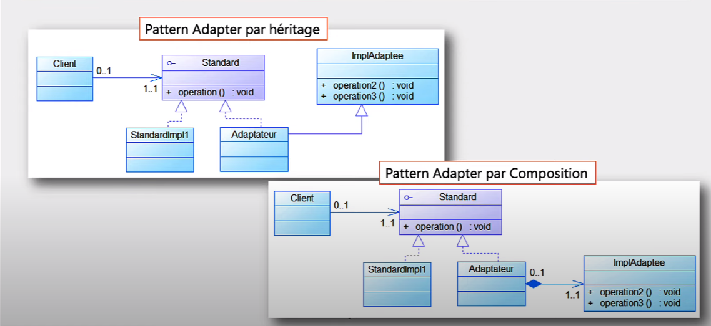

### Adapter Pattern
#### Description
The adapter pattern is a structural design pattern that allows objects with incompatible interfaces to collaborate.
#### Problem
HDMI and VGA are two different interfaces for connecting a monitor to a computer. A VGA monitor can't be connected to a computer with an HDMI cable and vice versa. The solution is to use an adapter that converts one interface to another.
#### Solution
The adapter pattern converts the interface of a class into another interface that the client expects. Adapter lets classes work together that couldn't otherwise because of incompatible interfaces.
### Class Diagram

### Implementation
#### Example for a VGA to HDMI adapter

##### VGA interface
```java
public interface VGA {
    void print(String message);
}
```
##### VGA monitor
```java
public class Ecran implements VGA {
    @Override
    public void print(String message) {
        System.out.println("========== Ecran ==========");
        System.out.println(message);
        System.out.println("===========================");
    }
}
``` 

```java
public class VideoProjector implements VGA{
    @Override
    public void print(String message) {
        System.out.println("............ VP ...........");
        System.out.println(message);
        System.out.println("...........................");
    }
}
```
##### HDMI interface
```java
public interface HDMI {
     void view(byte[] data);
}
```
##### HDMI monitor
```java
public class TV implements HDMI {
    @Override
    public void view(byte[] data) {
        System.out.println("----------- TV ----------");
        String message = new String(data);
        System.out.println(message);
        System.out.println("---------------------------");
    }
}
```
##### Unite centrale
```java
public class UniteCentrale {
    private VGA vga;

    public void print(String message){
        System.out.println("************ UC ***********");
        vga.print(message);
        System.out.println("***************************");
    }

    public void setVga(VGA vga) {
        this.vga = vga;
    }
}
```
##### HdmiVgaAdapter
```java
public class HdmiVgaAdapterUsingComposition implements VGA {
    private HDMI hdmi;

    @Override
    public void print(String message) {
        System.out.println("~~~~~~~~~~~ Adapter ~~~~~~~~~~");
        byte[] data = message.getBytes();
        hdmi.view(data);
        System.out.println("~~~~~~~~~~~~~~~~~~~~~~~~~~~~~~~");

    }

    public void setHdmi(HDMI hdmi) {
        this.hdmi = hdmi;
    }
}
```
##### Explanation
The adapter pattern is used when:
- you want to use an existing class, and its interface does not match the one you need.
- you want to create a reusable class that cooperates with unrelated or unforeseen classes, that is, classes that don't necessarily have compatible interfaces.

### Conclusion

The adapter pattern is a structural design pattern that allows objects with incompatible interfaces to collaborate. The adapter pattern converts the interface of a class into another interface that the client expects. Adapter lets classes work together that couldn't otherwise because of incompatible interfaces.
